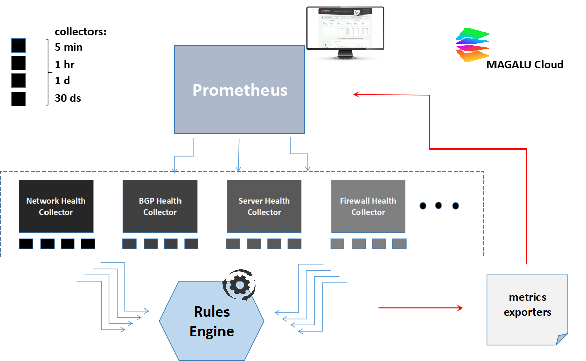

# MagaluObservatory
Programas e Regras de Observabilidade para Magalu Cloud

## 1. Métricas de Rede (Load, Errors, Buffers, Environment)

Estas métricas indicam o volume e o tipo de dados que os equipamentos de rede estão processando, assim como as condições de ambiente. São essenciais para avaliar a carga de trabalho e identificar possíveis gargalos.

| Métrica                        | Descrição                                      |
|--------------------------------|------------------------------------------------|
| `% bandwidth`                  | Tráfego por interfaces e canais                |
| `% errors`                     | Taxa de pacotes com erros (ingress e egress)   |
| `% discards`                   | Taxa de pacotes não processados                |
| `temperature`                  | Alta temperatura reduz vida útil               |
| `fan speede power status`      |	Pode indicar falha de hardware                |
| `link status`                  | Up/Down                                        |
| `% retransmissions`            | Indicativo de perda de pacotes                 |
| `% collisions`                 | Detecção de possíveis problemas (full duplex)  |
| `% cpu utilization`            | Uso de CPU                                     |
| `% memory_usage`               | Uso de memória                                 |

