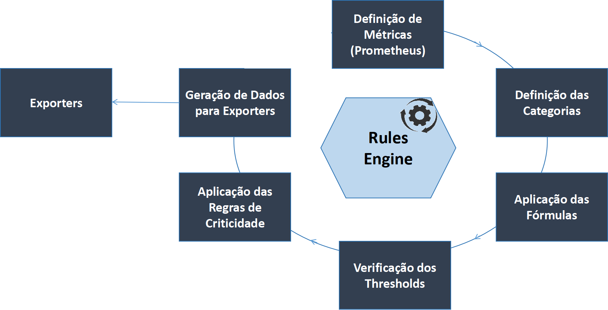

## Magalu Cloud - Observability
Programas e Regras de Observabilidade para Magalu Cloud

Serão estabelecidos os principais componentes da arquitetura, com ênfase sobre Coletores e "Rules Engine" permitindo que fórmulas sejam aplicadas sobre as chamadas Macro-Métricas ou Categorias.

<p align="center">
    
</p>
<br>


## Rules Engine
Criado para permitir total desacoplamento dos códigos associados aos coletores.
<br>
<br>

<p align="center">
    
</p>
<br>

## Arquivos de Configuração e Programas de Apoio

Para um melhor entendimento da solução, serão primeiro definidos os principais arquivos e programas de apoio, responsáveis pela coleta, cálculo, análise e classificação das métricas.
O design da solução proposta visa a desacoplar o código dos módulos das atividades de configuração, de tal forma que exclusões, adições de novas métricas ou mesmo o incremento de novas fórmulas evitem alterações destes módulos .  

---

### `metrics.yaml` - Definição de Métricas e Categorias

Arquivo cujo conteúdo define as **categorias** e todas as **métricas dependentes**, cujos os valores são coletados pelos exporters já disponibilizados no Prometheus.
Inicialmente, estes são os valores configurados voltados à monitoração de Redes, BGP e Servidores:
<br>


| Categoria            | Métricas                                                                 |
|----------------------|--------------------------------------------------------------------------|
| processor            | hrProcessorLoad                                                          |
| storage              | hrStorageSize<br>hrStorageUsed<br>hrStorageDescr                         |
| temperature          | lmTempSensorsValue                                                       |
| bandwidth            | ifHCInOctets<br>ifHCOutOctets<br>ifHighSpeed                             |
| indiscards           | ifHCInBroadcastPkts<br>ifHCInMulticastPkts<br>ifHCInUcastPkts<br>ifInDiscards |
| outdiscards          | ifHCOutBroadcastPkts<br>ifHCOutMulticastPkts<br>ifHCOutUcastPkts<br>ifOutDiscards |
| inerrors             | ifHCInBroadcastPkts<br>ifHCInMulticastPkts<br>ifHCInUcastPkts<br>ifInErrors |
| outerrors            | ifHCOutBroadcastPkts<br>ifHCOutMulticastPkts<br>ifHCOutUcastPkts<br>ifOutErrors |
| bgp                  | bgpPeerState<br>bgpPeerFsmEstablishedTime<br>bgpPeerInTotalMessages<br>bgpPeerOutTotalMessages<br>bgpPeerInUpdates<br>bgpPeerOutUpdates |
| cpu_load             | node_cpu_seconds_total                                                   |
| cpu_queue            | node_load1                                                               |
| io_load              | node_cpu_seconds_total                                                   |
| io_queue             | node_disk_io_time_weighted_seconds_total                                 |
| memory               | node_memory_MemFree_bytes<br>node_memory_Buffers_bytes<br>node_memory_Cached_bytes<br>node_memory_MemTotal_bytes |
| memory_swapping      | node_vmstat_pswpin<br>node_vmstat_pswpout                                |
| network_errors       | node_network_receive_errs_total<br>node_network_transmit_errs_total      |
| filesystem           | node_filesystem_avail_bytes<br>node_filesystem_size_bytes                |
| smartmon_temperature | smartmon_airflow_temperature_cel_value                                   |
| nvme_temperature     | nvme_temperature_celsius                                                 |

Por exemplo, a categoria `bandwidth` possui como dependentes as seguintes métricas para o cálculo do consumo de largura de banda em qualquer interface:
* `ifHCInOctets`
* `ifHCOutOctets`
* `ifHighSpeed`

---

### `jobs.yaml`

Arquivo de configuração cujo o objetivo é associar os **jobs do Prometheus**, com os nomes definidos para as categorias presentes no arquivo de configuração **metrics.yaml**.
Vale ressaltar que em **jobs.yaml**, é possível definir que um mesmo conjunto de categorias possa ser utilizado por múltiplos jobs, refletindo cenários onde diferentes dispositivos ou sistemas compartilham o mesmo perfil de métricas. Verifique no atual conteúdo, que o mesmo conjunto de categoria **server_categories** foi associado a dois jobs distintos: **node_guest e node_host**

```yaml
common_network_categories: &network_categories
  - processor
  - storage
  - temperature
  - bandwidth
  - indiscards
  - outdiscards
  - inerrors
  - outerrors

common_server_categories: &server_categories
  - cpu_load
  - cpu_queue
  - io_load
  - io_queue
  - memory
  - memory_swapping
  - network_errors
  - filesystem
  - smartmon_temperature
  - nvme_temperature

jobs:
  - name: network_switch_os10
    categories: *network_categories

  - name: network_switch_cumulus5
    categories: *network_categories

  - name: network_switch_os10_bgp
    categories:
      - bgp

  - name: node_guest
    categories: *server_categories

  - name: node_host
    categories: *server_categories
```

---

### `formulas.py`

Define como as **categorias** deverão ser processadas utilizando o conjunto das métricas definidas em **metrics.yaml**.

O arquivo é dividido em duas seções:

1. **Funções de cálculo** onde são expostas as fórmulas com referência às metricas, utilizadas no cálculo de cada categoria de interesse
2. **Mapa de associação** onde são associados os nomes das categorias e os nomes das respectivas funções onde os cálculos serão realizados

Segue um trecho do código em **formulas.py** onde as categorias de Rede são calculadas. Vale ressaltar que para a inclusão de um nova categoria e sua função corrspondente, as métricas utilizadas na fórmula deverão ser antes declaradas no arquivo de configuração **metrics.yaml**.

```python
########################################################################
#                  Seção de Definição das Fórmulas                     #
########################################################################
def processor(row):
    """
    Calcula a média da carga de CPU considerando múltiplos núcleos (ex: hrProcessorLoad por core).
    Ignora campos não numéricos e valores ausentes (NaN).
    """
    return float(row.get("value", 0.0))

# Adicione aqui outras fórmulas específicas por categoria, se necessário:
def storage(row):
    """
    Percentual de uso da memória física (hrStorage).
    Espera hrStorageUsed e hrStorageSize no dicionário.
    """
    try:
        used = float(row.get("hrStorageUsed", 0))
        size = float(row.get("hrStorageSize", 1))  # evita divisão por zero
        return (used / size) * 100 if size > 0 else 0.0
    except Exception:
        return 0.0

def bandwidth(row):
    return 8 * 100 * (row['ifHCInOctets'] + row['ifHCOutOctets']) / (row['ifHighSpeed'] * BITS_IN_MEGABIT * row['time_diff_seconds']) if row['ifHighSpeed'] > 0 else 0

def indiscards(row):
    total = row['ifHCInBroadcastPkts'] + row['ifHCInMulticastPkts'] + row['ifHCInUcastPkts']
    return (100 * row['ifInDiscards']) / total if total > 0 else 0

def outdiscards(row):
    total = row['ifHCOutBroadcastPkts'] + row['ifHCOutMulticastPkts'] + row['ifHCOutUcastPkts']
    return (100 * row['ifOutDiscards']) / total if total > 0 else 0

def inerrors(row):
    total = row['ifHCInBroadcastPkts'] + row['ifHCInMulticastPkts'] + row['ifHCInUcastPkts']
    return (100 * row['ifInErrors']) / total if total > 0 else 0

def outerrors(row):
    total = row['ifHCOutBroadcastPkts'] + row['ifHCOutMulticastPkts'] + row['ifHCOutUcastPkts']
    return (100 * row['ifOutErrors']) / total if total > 0 else 0


########################################################################
#                  Seção de Definição das Funções                      #
########################################################################
formula = {
    'storage': storage,
    'bandwidth': bandwidth,
    'indiscards': indiscards,
    'outdiscards': outdiscards,
    'inerrors': inerrors,
    'outerrors': outerrors
}
```

---

### `config.yaml`

Arquivo que define os **thresholds** para os valores calculados por categoria, conforme definidos em `formulas.py`.

Cada categoria possui dois thresholds:

* `warning`
* `critical`

Adicionalmente, o campo `score_direction` indica se a categoria possui comportamento **positivo** (maior é melhor) ou **negativo** (maior é pior).

Utilize o mesmo nome de categoria definido nos demais arquivos de configuração, vistos até aqui. 

### Exemplo:

Para a categoria `bandwidth`, classificada como score negativo, foram definidos os seguintes thresholds
```yaml
  bandwidth:
    warning: 70
    critical: 90
```
onde, 
* Valor ≥ 90% → `CRITICAL`
* Valor entre 70% e 89.9% → `WARNING`
* Valor < 70% → `OK`

---

### `time_window.py`

Arquivo que define as **janelas de tempo** utilizadas para coleta e cálculo das métricas: 

O atual conteúdo do programa ´resumido com as seguintes linhas:

```python
from datetime import timedelta

time_windows = {
    "5m": timedelta(minutes=5),
    "1h": timedelta(hours=1),
    "24h": timedelta(hours=24),
    "30d": timedelta(days=30),
}
```

Cada entrada no dicionário **time_window** dfine:

* O **nome da janela** (`5m`, `1h`, `24h`, `30d`)
* O **intervalo de tempo real** em que as métricas serão avaliadas

Estas granularidades permitirão:
* Avaliações em tempo real (ex: `5m`, `1h`)
* Análises históricas de médio e longo prazo (ex: `24h`, `30d`)

---

### `metrics_exporter.py`

Este arquivo exporta os valores dos status e estatísticas (média, máximo, mínimo, desvio padrão) das categorias utilizando **PushGateway** do Prometheus.

A função `export_health()` foi estendida para aceitar labels adicionais (`labels_extra`) derivados dinamicamente a partir dos labels Prometheus usados como índice nas métricas (ex: `vrf`, `iface`, `disk`, `core`).

Isso permite granularidade máxima e suporte automático a novos identificadores em tempo de execução.

Exemplo de chamada:

```python
export_health(
  device=device,
  window="1h",
  metric="node_cpu_seconds_total",
  status="OK",
  category="cpu",
  job="server",
  stats={...},
  labels_extra={"core": "0", "cpu": "cpu0"}
)
```

Os registradores `Gauge` são recriados dinamicamente conforme os labels extras, e os valores são enviados ao PushGateway usando `job=health_<nome_do_job>`.

---

### `discovery.py`

Script principal responsável por orquestrar o processo de coleta, análise e exportação dos dados de saúde por categoria e por janela de tempo.

#### Principais responsabilidades:

* Carrega arquivos de configuração: `jobs.yaml`, `metrics.yaml`, `config.yaml`, `time_window.py`.
* Para cada job definido, consulta o Prometheus para descobrir as instâncias disponíveis (`instance` labels).
* Para cada categoria atribuída ao job, coleta as métricas associadas dentro da janela de tempo definida.
* Aplica a função de cálculo correspondente à categoria, conforme definido em `formulas.py`.
* Classifica o valor como `OK`, `WARNING` ou `CRITICAL` de acordo com os thresholds.
* Exporta os resultados agregados para o PushGateway utilizando `metrics_exporter.py`.

O script também mantém um controle local para evitar reprocessamento dentro do mesmo intervalo (`window_exec_state.json`).

Além disso, o `discovery.py` extrai automaticamente labels do índice das séries Prometheus, permitindo exportar métricas com granularidade por `vrf`, `iface`, `disk`, `core` e outras dimensões.

<br>

## 1. Métricas de Rede (Load, Errors, Buffers, Environment)

Estas métricas indicam o volume e o tipo de dados que os equipamentos de rede estão processando, assim como as condições de ambiente. São essenciais para avaliar a carga de trabalho e identificar possíveis gargalos.

| Categoria                      | Descrição                                      |
|--------------------------------|------------------------------------------------|
| `% bandwidth`                  | Tráfego por interfaces e canais                |
| `% errors`                     | Taxa de pacotes com erros (ingress e egress)   |
| `% discards`                   | Taxa de pacotes não processados                |
| `temperature`                  | Alta temperatura reduz vida útil               |
| `fan speede power status`      |	Pode indicar falha de hardware                |
| `link status`                  | Up/Down                                        |
| `% retransmissions`            | Indicativo de perda de pacotes                 |
| `% collisions`                 | Detecção de possíveis problemas (full duplex)  |
| `% cpu utilization`            | Uso de CPU                                     |
| `% memory usage`               | Uso de memória                                 |

<br>

## 2. Métricas BGP

Contempla as principais métricas que devem ser monitoradas em sessões BGP para garantir visibilidade, estabilidade e operação segura de redes com roteamento dinâmico.


| **Categoria**                     | **Descrição**                                                             |
|-----------------------------------|---------------------------------------------------------------------------|
| `Session State`                   | Estado da sessão BGP (Idle, Connect, Active, OpenSent, OpenConfirm, Established) |
| `% received message`              | Taxas de mensagens BGP recebidas                                         |
| `% sent menssages`                | Taxa de mensagens BGP enviadas                                          |
| `% received prefixes`             | Número de prefixos anunciados pelo peer                                  |
| `% advertised prefixes`           | Quantidade de rotas que estão sendo anunciados                             |
| `% received updates`              | taxa de atualizações de rotas recebidas                                 |
| `% sent updates`                  | Atualizações enviadas para os peers                                      |
| `flaps` / `session changes`       | Número de sessões que caíram e subiram novamente                       |
| `% errors`                        | Erros no recebimento/envio de mensagens BGP                           |


<br>

## 3. Métricas de Servidores

Obtém um conjunto essencial de métricas para monitorar servidores físicos ou virtuais. O acompanhamento contínuo dessas métricas é fundamental para garantir a **disponibilidade**, **desempenho** e **segurança** da infraestrutura.


| **Categoria**                   | **Descrição**                                                                 |
|-------------------------------|-------------------------------------------------------------------------------|
| `% cpu usage`                   | Porcentagem de utilização da CPU (total ou por núcleo)                      |
| `load average`                | Média de carga do sistema nos últimos 1, 5 e 15 minutos                     |
| `% memory usage`                | Percentual de memória RAM utilizada                                         |
| `% swap usage`                  | Uso de memória swap (pode indicar pressão na RAM)                           |
| `% disk usage`                  | Espaço utilizado em disco (por partição ou volume)                           |
| `% disk io read`, `% disk io write` | Taxa de leitura/gravação em disco (MB/s ou IOPS)                          |
| `% filesystem usage`          | Uso do espaço em filesystems                                                       |
| `% bandwidth`                  | Consumo da largur de banada por interface                                    |
| `% network errors`            | Erros e perdas nas interfaces de rede                                  |
| `process_count`               | Número total de processos em execução                                        |
| `open file descriptors`       | Total de arquivos e conexões abertos — pode causar falhas se atingir limite  |
| `temperature`                 | Temperatura da CPU, disco ou GPU (se disponível via sensores)               |
| `fan_speed`, `power_supply_status` | Velocidade das ventoinhas e status da fonte de alimentação            |
| `service availability`        | Disponibilidade de serviços essenciais (via ping, TCP, HTTP, etc.).         |


<br>

## 4. Métricas de Firewalls

Como principais métricas para monitoramento de **firewalls físicos ou virtuais**, essenciais para garantir **segurança**, **desempenho de rede** e **conformidade** com políticas de acesso, detacam-se:


 **Categoria**                           | **Descrição**                                                                 |
|----------------------------------------|-------------------------------------------------------------------------------|
| `cpu_usage`                            | Utilização da CPU — alta carga pode causar latência em inspeções.            |
| `memory_usage`                         | Utilização da RAM — fundamental para análise de pacotes e sessões ativas.    |
| `active connections`                   | Total de conexões ativas no momento.                                         |
| `connections rate`                     | Taxa de criação de novas conexões por segundo.                               |
| `dropped packets`                      | Pacotes descartados por regras, limite ou erro.                              |
| `blocked_connections`                  | Conexões explicitamente bloqueadas pelas regras de firewall.                 |
| `accepted connections`                 | Conexões aceitas (permitidas pelas regras).                                  |
| `interface errors`                     | Erros nas interfaces de rede (CRC, overrun, etc.).                           |
| `active sessions`                      | Número de sessões ativas (SSL/IPSec).                                        |
| `session utilization`                  | Percentual de uso da tabela de sessões.                                      |


